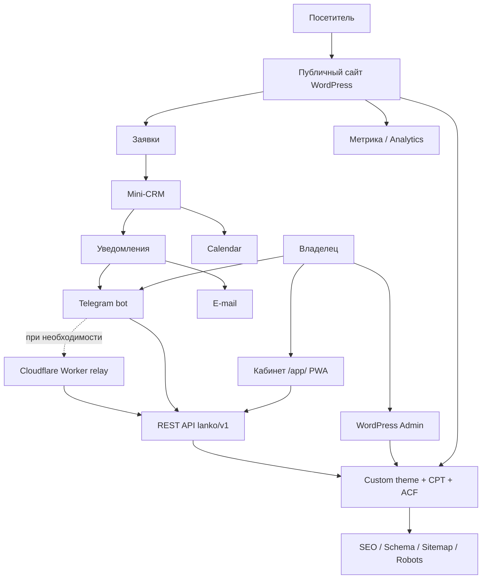

# Архитектура проекта Lanko.rf

## 1. Назначение

Проект решает одновременно три задачи:

1. **Публичный сайт питомника** — каталог щенков, новости, услуги и контакты.
2. **Операционная система владельца** — заявки, календарь, публикации, баннеры.
3. **Интеграционный слой** — REST API, Telegram, e-mail, аналитика и SEO.

## 2. Логическая схема

## 3. Слой данных

Основные сущности хранятся в WordPress, но оформлены как отдельные предметные модели:

- **Щенок / карточка животного** — кличка, пол, дата рождения, изображения, описание, статус публикации;
- **Новость / фотоальбом** — тег, заголовок, изображения, описание;
- **Заявка** — клиент, контакты, услуга, даты и дополнительные поля;
- **Настройки сайта** — контакты, баннеры, SEO-параметры, внешние ссылки;
- **Календарное событие** — визит, передержка или событие, производное от заявки.

Для структурирования WordPress использовались Custom Post Types и ACF-поля.

## 4. Миграция контента

Исходно данные были распределены между тремя сайтами. Миграция включала:

1. аудит HTML и медиа;
2. поиск битых страниц и файлов;
3. разбор исходных данных скриптами Python;
4. восстановление связей между сущностями и фото;
5. очистку текста;
6. подготовку единого датасета;
7. загрузку через импортёр в новую CMS.

Это был не механический перенос страниц, а **ETL-задача по нормализации исторического контента**.

## 5. Публичный интерфейс

Принципы:

- mobile first / адаптив;
- минимум уровней вложенности;
- карточный интерфейс;
- фото как основной визуальный контент;
- логика «щенки → заявка» без лишних переходов;
- новости и фотоальбомы в одной модели публикации.

## 6. Кабинет владельца

`/app/` — упрощённый frontend поверх WordPress REST API.

Функции:

- dashboard;
- CRUD щенков;
- CRUD публикаций;
- заявки и статусы;
- календарь;
- баннеры;
- загрузка медиа.

PWA даёт установку на главный экран и service worker. В проекте также предусматривалась Android WebView-обёртка.

## 7. Интеграции

### Telegram

Telegram-бот используется как альтернативный канал управления и уведомлений. Для нескольких администраторов хранится соответствие между username и chat_id.

### Cloudflare Worker

Relay нужен только при ограничениях хостинга на входящие webhook-запросы. Он не является обязательной частью бизнес-логики.

### Аналитика

Идентификаторы Яндекс.Метрики и Google Analytics задаются в настройках, без правки шаблонов.

## 8. SEO

В тему встроены:

- мета-данные;
- canonical;
- Open Graph;
- JSON-LD;
- sitemap;
- robots;
- страницы с предсказуемыми URL;
- настройки SEO-текстов.

## 9. Производительность

Основные решения:

- приоритет первого hero-изображения;
- lazy loading остального контента;
- `defer` для скриптов;
- фиксированные размеры изображений для уменьшения layout shift;
- WebP и кэширование на уровне хостинга/плагина;
- отказ от тяжёлых анимаций там, где они влияли на загрузку.

## 10. Что не хранится в публичном репозитории

- production-конфигурация;
- секреты и API keys;
- персональные данные;
- дамп базы;
- закрытые настройки WordPress;
- внутренние данные заявок;
- полный production source темы, если он содержит эксплуатационные настройки.

Публичный репозиторий описывает архитектуру и результат как кейс.
